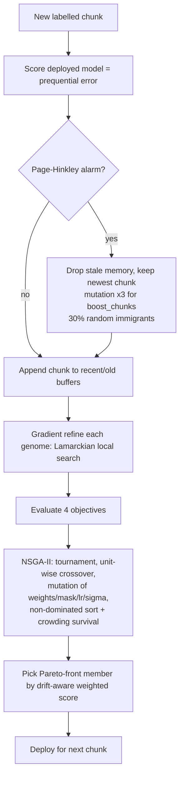

# Alpha-architects
# Adaptive Multi-Objective Evolutionary Deep Learning for Non-Stationary Streams

**Problem statement:** *Adaptive Multi-Objective Evolutionary Deep Learning for Robust Classification under Non-Stationary Data Distributions.*

**Vertical:** Machine-learning research / streaming classification under concept drift and covariate shift.

A pure-NumPy library (no deep-learning framework needed) that evolves a population of neural networks
with **NSGA-II**, detects drift online, and re-configures the search when the data distribution changes.
It ships with drifting-stream generators, three baselines, a prequential evaluator, 36 tests, and CI.

## 1. Approach and algorithmic logic

Each network is a **genome**: weights for up to `max_hidden` tanh units, a boolean **mask** that switches
units on/off (evolvable architecture), a learning rate and a self-adaptive mutation step `sigma`.

**Four objectives, all minimised** (`adaptive_evo/evolver.py::_evaluate`):

| # | Objective | Meaning |
|---|-----------|---------|
| 1 | `recent_error` | error (+ 0.05·cross-entropy) on the recent window — *plasticity* |
| 2 | `stability_error` | same metric on older buffered data — *stability / memory* |
| 3 | `noise_error` | error on the recent window with Gaussian input noise — *robustness* |
| 4 | `complexity` | active hidden units / `max_hidden` — *parsimony* |

Plasticity vs. stability is the core tension in non-stationary learning; the Pareto front exposes it
instead of hard-coding a trade-off.

**Per-chunk loop** (`AdaptiveEvolutionaryClassifier.partial_fit`):



Key mechanisms
* **Drift detection:** Page-Hinkley test on the deployed model's per-chunk error (`drift.py`).
* **Drift response:** memory reset, mutation boost (`drift_boost`), random immigrants, more generations (`drift_generations`).
* **Selection from the front:** weights `(0.55, 0.20, 0.20, 0.05)` normally, `(0.80, 0.02, 0.15, 0.03)` right after drift (favour recency).
* **Hybrid search:** evolution explores architecture/learning rate/basins; a few gradient steps per offspring exploit them.
* **Self-adaptive mutation:** `sigma` is itself evolved (log-normal), so step sizes tune themselves.

## 2. Project layout

```
adaptive_evo/
  streams.py    drifting stream generators (sudden, gradual, incremental, recurring, covariate)
  network.py    NumPy MLP genome, analytic gradients, masked forward pass
  nsga2.py      non-dominated sort, crowding distance, environmental selection, tournament
  drift.py      Page-Hinkley detector
  evolver.py    AdaptiveEvolutionaryClassifier + EvoConfig
  baselines.py  StaticMLP, OnlineMLP, WindowMLP
  evaluate.py   prequential (test-then-train) evaluation, post-drift accuracy, recovery time
run_demo.py     benchmark + plots + metrics.json
tests/          unittest-style tests, run by pytest
results/        generated plots and metrics.json
```

## 3. How to run

```bash
python -m venv .venv && source .venv/bin/activate      # Windows: .venv\Scripts\activate
pip install -r requirements.txt
pytest -q                                              # 36 tests
python run_demo.py --seeds 3 --out results             # ~2 min; writes results/*.png + metrics.json
python run_demo.py --kinds sudden --seeds 1            # quick run
```

Library use:

```python
from adaptive_evo import AdaptiveEvolutionaryClassifier, EvoConfig, make_stream

stream = make_stream("sudden", seed=0)
model = AdaptiveEvolutionaryClassifier(EvoConfig(n_classes=stream.n_classes))
for lo in range(0, len(stream.y), 100):
    X, y = stream.X[lo:lo+100], stream.y[lo:lo+100]
    if lo: print(lo, (model.predict(X) == y).mean())   # test ...
    model.partial_fit(X, y)                            # ... then train
```

## 4. Results (mean of 3 seeds, 6000-sample streams, 100-sample chunks)

Prequential accuracy; "post-drift" = mean accuracy over the 5 chunks after each true drift.

| Stream | Static | Online SGD | Window MLP | **Evo-MOO (ours)** |
|--------|-------:|-----------:|-----------:|-------------------:|
| sudden      | 0.465 | 0.789 | 0.761 | **0.801** (post-drift 0.683) |
| gradual     | 0.482 | 0.789 | 0.762 | **0.801** (0.680) |
| incremental | 0.489 | 0.798 | 0.769 | **0.807** (0.709) |
| recurring   | 0.719 | 0.817 | 0.799 | **0.819** (0.729) |
| covariate   | 0.840 | 0.875 | **0.879** | 0.878 (0.852) |

Plots per stream: `results/<kind>.png`; full numbers in `results/metrics.json`.

**Honest reading.** The evolutionary model clearly beats the non-adaptive baseline and edges out the
strongest baselines (about +1 point of accuracy, and the fastest recovery on sudden drift), but the margin over
well-tuned online SGD is small on this synthetic benchmark and it is ~30x slower (~5 s vs ~0.2 s per stream).
Page-Hinkley reliably flags sudden drift within 1 chunk; it is late or silent on gradual/incremental/covariate
drift, where the population's continual refinement does the adapting instead. Differences of ~1 point are
within seed noise (3 seeds); no significance test was run.

## 5. Assumptions and operational constraints

* Labels arrive after each chunk (test-then-train); chunks are >= 2 samples (100 used in experiments).
* Class count is known in advance and labels are integers `0..n_classes-1`; the feature count is fixed.
* Features are roughly standardised (no online normaliser is included).
* Data is synthetic, generated from random teacher networks, so ground-truth drift points are known. Real-data
  performance was not evaluated.
* Detector thresholds (`ph_delta=0.02`, `ph_threshold=0.5`) assume per-chunk error in [0, 1] and chunk size ~100.
* Everything is CPU-only NumPy; runtime scales with `pop_size x (generations + 1) x refine_steps`.
* Randomness is seeded (`EvoConfig.seed`) so runs are reproducible.

## 6. Security, quality and testing

* No API keys, credentials, network calls, `eval`/`pickle`, or file reads of untrusted input; `.gitignore`
  excludes `.env`/keys. Inputs are validated (shape, NaN/inf, label range, feature-count consistency).
* Full PEP 484 type hints; small modules with single responsibilities; dataclass config with validation.
* Tests cover: NSGA-II correctness (front partition, non-dominance, crowding, elitism), analytic-vs-finite-difference
  gradients, softmax normalisation, masking, stream determinism and shape, Page-Hinkley false-alarm/detection,
  classifier learning above chance, seeded reproducibility, Pareto-front validity, bounded memory, drift detection
  plus adaptation vs a static model, and evaluator metrics. CI runs `pytest` on every push.

## 7. License

MIT.
